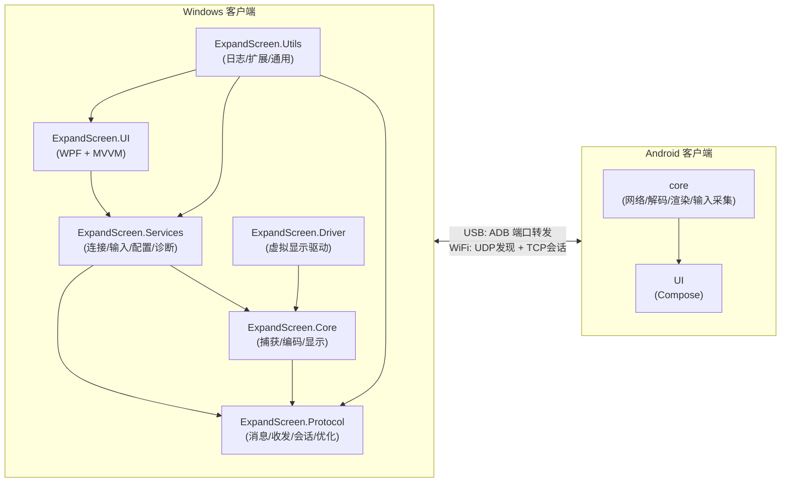
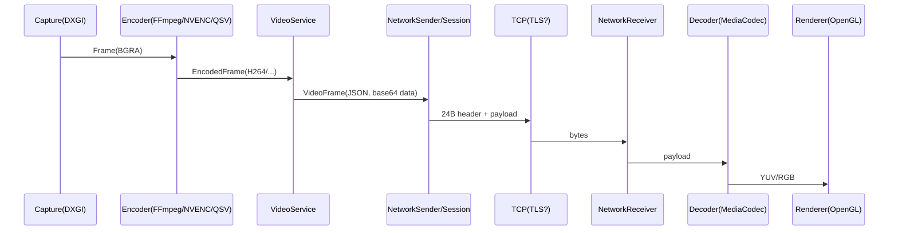
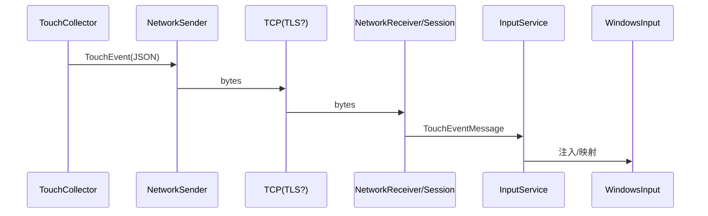

# 系统架构（Developer View）

本文档给出 ExpandScreen 的系统架构与关键数据流，方便快速理解模块边界与扩展点。

---

## 1. 组件视图

### 1.1 端到端结构

---

## 2. 解决方案结构

参考：`docs/DEVELOPMENT.md`（更偏“如何构建/调试”）

- `src/ExpandScreen.UI`：WPF 界面（设备选择、设置、运行状态）
- `src/ExpandScreen.Core`：屏幕捕获、编码、虚拟显示管理等核心逻辑
- `src/ExpandScreen.Services`：连接（USB/WiFi）、输入映射、配置、诊断等服务层
- `src/ExpandScreen.Protocol`：协议定义、消息序列化、会话、ABR/FEC 优化
- `src/ExpandScreen.Driver`：虚拟显示驱动（WDK）
- `src/ExpandScreen.Utils`：日志与通用工具
- `src/ExpandScreen.IntegrationTests`：端到端/协议行为集成测试

---

## 3. 关键数据流

### 3.1 视频链路（Windows → Android）

说明：

- 发送端会对 media 队列做流控/丢弃，优先保实时性。
- 可选 ABR/FEC：弱网下降码率，必要时用 parity 尝试恢复缺失帧。

### 3.2 触控链路（Android → Windows）

### 3.3 音频链路（Windows → Android）

- `AudioConfig`：JSON，协商采样率/声道/码率/帧长。
- `AudioFrame`：RAW bytes，时间戳写入 Header `Timestamp`。

相关实现：`src/ExpandScreen.Protocol/Network/NetworkSender.cs`、`src/ExpandScreen.Protocol/Messages/ProtocolMessages.cs`

---

## 4. 扩展点清单

- **协议扩展**：新增 `MessageType` + payload + 双端编解码；规则见 `docs/developer/API.md`
- **性能优化**：media 流控（码率/队列阈值/丢弃策略）、FEC 参数、关键帧策略
- **安全**：WiFi TLS（证书、配对码策略、诊断信息脱敏）
- **可观测性**：日志、会话统计（bytes/messages/rtt/loss）、诊断快照

